 

### Install

This project requires at least **Python 3.1** and the following Python libraries installed:

- [NumPy](http://www.numpy.org/)
- [Pandas](http://pandas.pydata.org)
- [Scikit-Learn](http://scikit-learn.org/stable/)
- [Matplotlib](http://matplotlib.org/users/installing.html/)
- [Seaborn](https://seaborn.pydata.org/installing.html/)

### Data

The dataset used in this project is included as `BostonHousing.csv`. This dataset is a freely available on the [UCI Machine Learning Repository](https://archive.ics.uci.edu/ml/datasets/). This dataset has the following attributes:

**Features**

`Features`: crim, zn, indus, chas, nox, rm, age, dis, rad, tax, ptratio, b, lstat, medv

crim = per capita crime rate by town

zn = proportion of residential land zoned for lots over 25,000 sq.ft.

indus = proportion of non-retail business acres per town

chas = Charles River dummy variable (= 1 if tract bounds river; 0 otherwise)

nox =  nitric oxides concentration (parts per 10 million)

rm = average number of rooms per dwelling

age = proportion of owner-occupied units built prior to 1940

dis = weighted distances to five Boston employment centers

rad = index of accessibility to radial highways

tax = full-value property-tax rate per 10,000 USD

ptratio = pupil-teacher ratio by town

b = 1000(Bk — 0.63)² where Bk is the proportion of blacks by town

lstat = % lower status of the population      

**Target Variable**

`Target`: medv

### Data Visualization

A heatmap was drawn for the correlation between the features

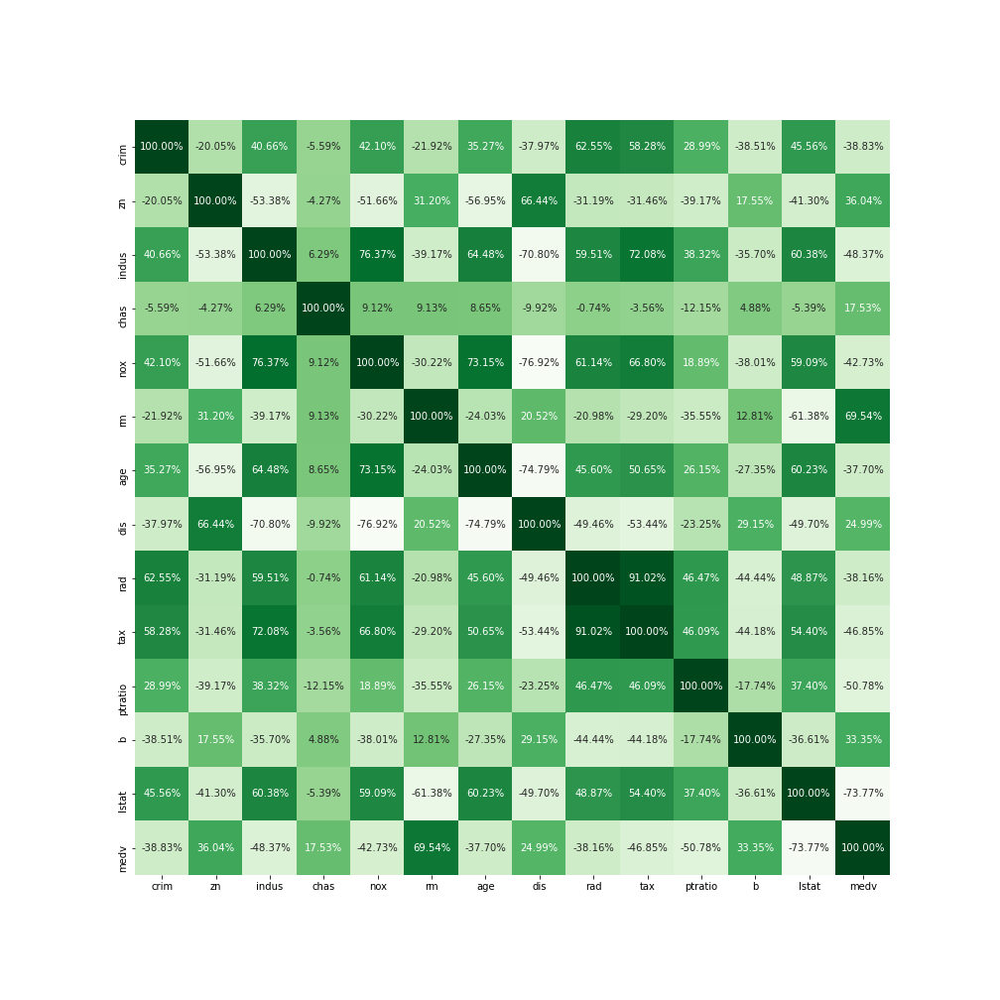

It helped in giving the correlation between the features available in the dataset.

Furthermore, a heatmap for null values present in the dataset was plotted so that EDA (Exploratory Data Analysis) could be done.

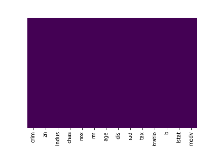

The frequency of values in column `rad` was visualized using a histogram.

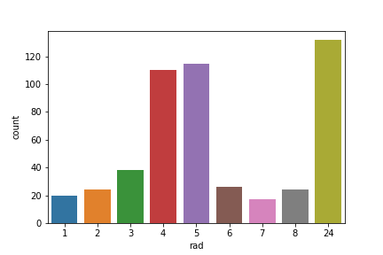

Similarily, the above procedure was done with the column `chas`.

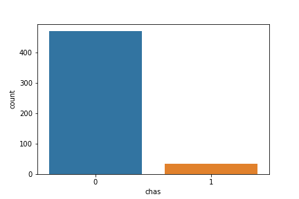

Later on, a countplot was plotted between column `rad` and `chas` to find the correlation.

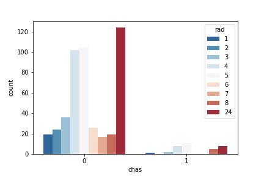

To understand the distribution of age groups in column `age`, a histogram was plotted.

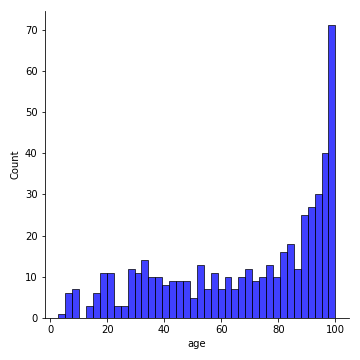

Same procedure was followed with column `crim` and `rm`.

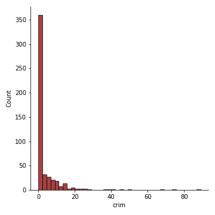

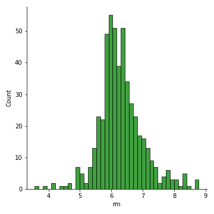

To identify the importance of certain features with regard to target variable, feature importance scores were generated.

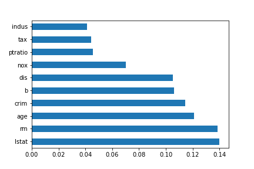

### Model Fitting

**Linear Regression**

The `train_test_split()` was applied to the dataset and the split was done on the basis of 70% data to be considered as `Training data` and 30% data to be considered as `Testing data`.

Therefore, the Training accuracy was measured as `76.45%`, Testing Accuracy as `67.33%` and Model Accuracy as `73.78%`.

To visualize the things up, a scatter plot was plotted between the Actual prices and the Predicted prices.

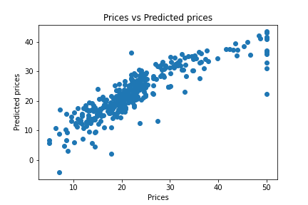

The scatter plot clearly indicates the huge presence of residuals. So, a scatter plot was plotted between Predicted and Residuals values.

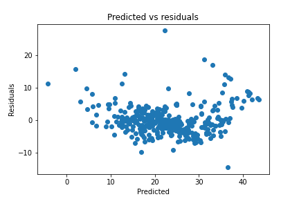

To clearly understand the relationship via numeric values between Residuals and their Frequency, a histogram was plotted between them.

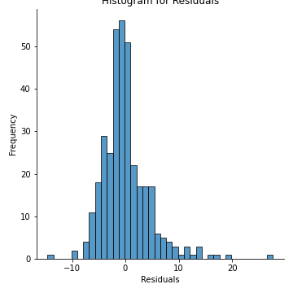

**Random Forest Regression**

The next algorithm that was applied on the dataset was Random Forest Regression. The splitting was done on the rule of 70-30. And, the Training Accuracy obtained was `99.99%` and the testing accuracy was `99.97%`. This algorithm worked well than Linear Regression as it provided much higher accuracies if compared to the Linear Regression.

A scatter plot for the relationship between Actual prices and Predicted prices clearly visualizes the whole scenario.

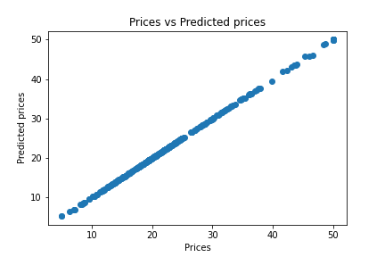

